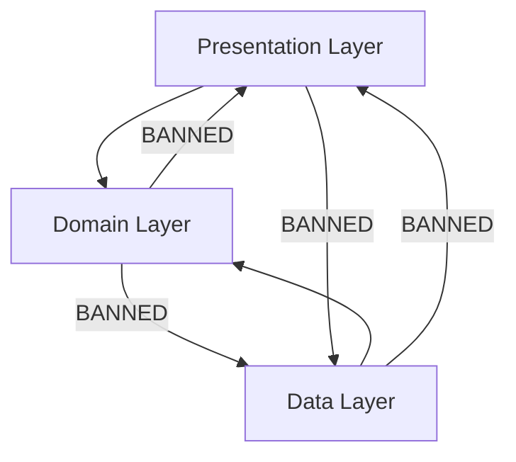

# Zuq CLI ⚡
### *The flexible, boundary-enforcing companion for Flutter Clean Architecture.*

[](https://pub.dev/packages/zuq_cli)
[](https://opensource.org/licenses/MIT)

**Zuq CLI** is a developer experience (DX) tool written in Dart, designed to scaffold, extend, and enforce architectural boundaries in Clean Architecture-based Flutter applications. 

Zuq provides developer choice and architectural flexibility by natively supporting popular state management options (**BLoC**, **Riverpod**, and **Provider**) and routing libraries (**GoRouter** and **AutoRoute**), all while enforcing consistency and safety through automated compliance auditing.

---

## 🎯 Key Features

*   **⚡ Flexible Scaffolding:** Create structured Flutter skeletons with your choice of State Management and Router libraries. Supports industry presets like `fintech` and `ecommerce`.
*   **🩺 Boundary Auditing (`zuq doctor`):** A static analyzer that audits your `lib/features` directory to prevent architectural drift (e.g. domain layers importing data/presentation layers). Perfect for Git hooks and CI pipelines.
*   **📦 Topological Module Installer (`zuq add module`):** Safely add pre-configured modules (Networking, Storage, L10n, Analytics, etc.) using a built-in topological dependency resolver that resolves execution order and prevents cyclic dependencies.
*   **📂 Feature Scaffolding (`zuq add feature`):** Generate complete Clean Architecture slices (domain, data, and presentation folders) matching your project's active state management library with a single command.

---

## 🚀 Installation

### Global Activation (Once Published)
```bash
dart pub global activate zuq_cli
```

### From Local Source (For Development)
Clone this repository and run the following command in the root folder:
```bash
dart pub global activate --source path .
```

---

## 🛠️ CLI Commands & Usage

### 1. Initialize a Project: `zuq create`
Scaffolds a new Flutter project skeleton. If options are omitted and you are in an interactive terminal, you will be prompted.

```bash
zuq create <project_name> [flags]
```

#### Available Flags:
| Flag | Abbreviation | Allowed Values | Default | Description |
| :--- | :--- | :--- | :--- | :--- |
| `--state` | `-s` | `riverpod`, `bloc`, `provider`, `none` | `none` | The state management engine |
| `--router` | `-r` | `go_router`, `auto_route` | `go_router` | The routing solution to use |
| `--preset` | `-p` | `default`, `fintech`, `ecommerce` | `default` | Preset architectural template |
| `--platforms` | | `android`, `ios`, `web`, `macos`, `linux`, `windows` | `android`, `ios` | Targeted platforms |

*Example:*
```bash
zuq create my_awesome_app --state riverpod --router go_router --platforms android ios web
```

---

### 2. Scaffold a Feature: `zuq add feature`
Generates a complete Clean Architecture slice for a specific feature.

```bash
zuq add feature <feature_name>
```

This generates the following structure under `lib/features/<feature_name>`:
```text
lib/features/my_feature/
├── data/
│   ├── datasources/
│   ├── models/
│   └── repositories/
├── domain/
│   ├── entities/
│   ├── repositories/
│   └── usecases/
└── presentation/
    ├── pages/
    ├── state/       # Prepopulated with Riverpod/BLoC/Provider boilerplate
    └── widgets/
```

---

### 3. Install Core Modules: `zuq add module`
Adds pre-configured architectural modules. Zuq automatically reads your project context (via `zuq.yaml`), injects code templates, and runs `flutter pub add` for required dependencies.

```bash
zuq add module <module_name>
```

#### Available Modules:
*   `networking` (depends on: `storage`, `analytics`) — Sets up a pre-configured `Dio` client, interceptors, and error handling.
*   `storage` — Configures secure and localized storage utilities.
*   `routing` — Auto-generates router setups based on GoRouter/AutoRoute choices.
*   `theme` — Sets up dark/light mode token structures.
*   `l10n` — Sets up standard localized resource structures.
*   `analytics` — Core telemetry tracking layout.

> [!TIP]
> **Topological Ordering:** If you add the `networking` module, Zuq will automatically resolve dependencies and install `storage` and `analytics` first in the correct order, avoiding cyclic bugs.

---

### 4. Audit Boundaries: `zuq doctor`
Runs static analysis checks against your project's clean-architecture boundaries. If any developer violates boundary constraints, it flags the file, line number, import source, and triggers a build failure code (`exit 1`).

```bash
zuq doctor
```

#### Enforced Import Boundaries:


*   **Domain:** Must be completely independent. It is prohibited from importing files from the `presentation` or `data` layers.
*   **Presentation:** Can only import from the `domain` layer (e.g. use cases, entities). Direct imports from `data` repositories/datasources are banned.
*   **Data:** Can only import interfaces from the `domain` layer. It cannot import code from the `presentation` layer.

---

## ⚙️ Configuration File: `zuq.yaml`

When you scaffold a project with `zuq create`, a `zuq.yaml` configuration file is generated in the root directory. This tells the CLI how to manage future additions:

```yaml
name: my_awesome_app
state_management: riverpod
router: go_router
preset: default
modules:
  - storage
  - analytics
  - networking
```

---

## 🛡️ Preventing Architectural Drift in CI
Integrate `zuq doctor` into your continuous integration flow to make sure no pull requests bypass architectural boundaries.

Add this step to your GitHub Actions workflow:

```yaml
name: Architectural Compliance Audit

on: [push, pull_request]

jobs:
  audit:
    runs-on: ubuntu-latest
    steps:
      - uses: actions/checkout@v3
      - uses: subosito/flutter-action@v2
        with:
          channel: 'stable'
      - name: Install Zuq CLI
        run: dart pub global activate --source path ./zuq_cli # Or 'dart pub global activate zuq_cli' once published
      - name: Run Architecture Audit
        run: zuq doctor
```

---

## 🤝 Contributing
Contributions are always welcome! Feel free to open issues, request additional state management integrations, or suggest improvements to the boundary checking engine.

1. Fork the Project
2. Create your Feature Branch (`git checkout -b feature/AmazingFeature`)
3. Commit your Changes (`git commit -m 'Add some AmazingFeature'`)
4. Push to the Branch (`git push origin feature/AmazingFeature`)
5. Open a Pull Request

---

## 📄 License
Distributed under the MIT License. See `LICENSE` for more information.
